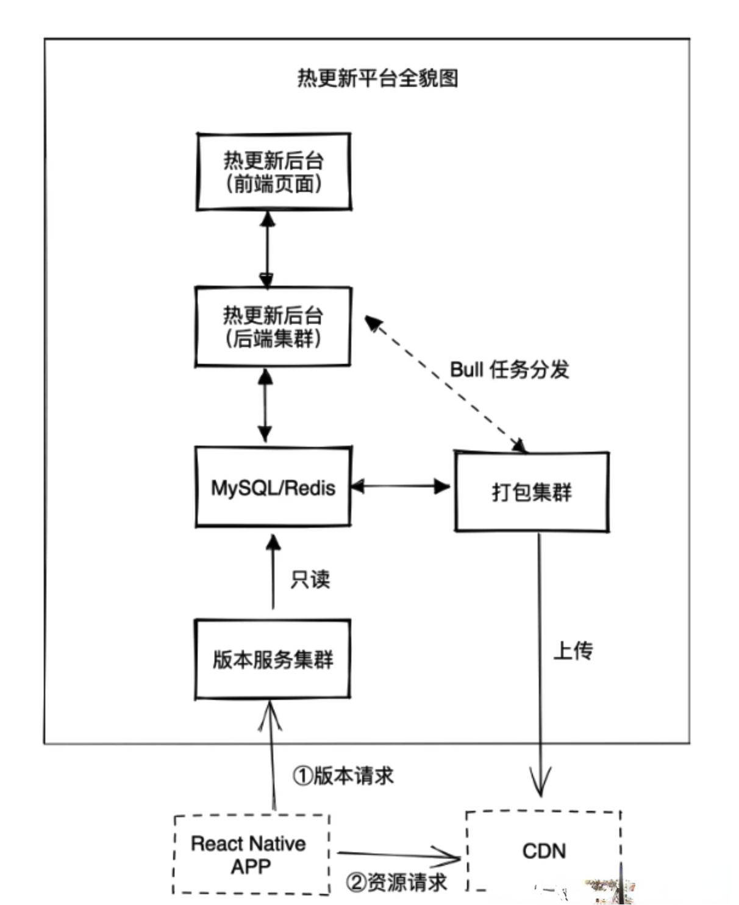

# 搭建React Native热更新平台的详细过程

##### 目录

-   一，什么是热更新
-   二，热更新方案
-   三，热更新原理
-   四，CDN 热更新方案
-   五，纯 CDN 方案的弊端
-   六，线上方案
-   七、整体方案梳理
-   八，总结

## 一，什么是热更新

所谓热更新，也叫做动态更新，一种类似 Web 的更新方式。相对于 App 的发版更新而言，热更新能及时的修复线上存在的问题，大幅的提升业务迭代效率。我们都知道，互联网业务讲究兵贵神速，如果业务能够通过热更新来快速发版和迭代，这就相当于在产品和用户之间搭建了一座能够随时通行的桥梁，代替了原来好几周才能有一次迭代的问题。

那么，热更新和发版更新有什么不同呢？为什么热更新比发版更新快这么多呢？下面是这两种更新方式的原理对比图。


发版更新，指的是你把 React Native App，当作 Android App 和 iOS App，按照 Android、iOS 上架流程，通过各自的应用商店进行更新。通常每个 Native App 都会有一个自己的上架节奏，可能是两周，也可能是 4 周。此外，从提交应用商店到审核通过，也需要等上几天时间。甚至，即便新版本上架了，用户更新到最新版本也需要一个过程，可能需要一个月的时间，新版本才能覆盖到 90% 的用户。

所以说，如果你的 React Native App 选择发版更新，就会受到发版节奏、审核耗时和版本覆盖耗时的影响，这些都会导致业务迭代速度变慢。

不过，React Native 的热更新就可以绕过应用商店直接进行更新。只要你的是集成热更新功能的 React Native App，在应用商店上架过一次之后，后续你的业务都可以走你自己的热更新流程，再也不用依赖应用商店发版。这样你的业务就能随时上线，随时更新了。

## 二，热更新方案

虽然官方没有提供标准的热更新方案，不过能够支持常见热更新方案有pushy、CodePush、Expo 和自研。

不过，由于国内网络环境的原因，访问国外的云服务速度比较慢，所以我不太推荐直接使用 Code Push 和 Expo。Code push 是微软 App Center 的服务之一，它底层用的是微软自家的 Azure 云服务；Expo 使用的是亚马逊的 AWS 和 Google Cloud 云服务。

不过，大家也可以基于 Code Push 或 Expo 自行搭建热更新服务。如果你嫌自己搭建太麻烦，你也可以看看 React Native 中文网提供的 Pushy 热更新方案。它使用的是国内的阿里云服务，且有比前两者更省流量的差量更新方案，应该是国内目前市面上唯一可以直接使用的开源热更新方案了。

## 三，热更新原理

说到自研热更新平台，如果你没有接触过，可能会认为很难，但事实上并非如此。其实，自研热更新平台的难度主要体现在如何大规模应用上，还有到达率上。对于规模小的应用来说，搭建一个自研热更新平台本身并不是很难。总的来说，一个自研热更新平台，主要包括这两个部分：

-   打包服务：Bundle Server；
-   静态资源服务：Static Server。

所谓的打包服务，是将 React Native 项目中的所有 JavaScript 代码打包成一个 Bundle 文件的服务。而所谓的静态资源服务，是将 Bundle 文件分发给客户端的服务；当客户端拿到 Bundle 代码后，执行 加载Bundle 文件就能渲染 React Native页面了。

其实，这和我们本地的npm start的流程是一样的。即我们在本地通过 npm start 启动的 Metro 服务时，Metro 服务就同时具备了打包和静态资源下发两种功能，再配合框架默认的代码加载功能就完成了热更新。

也就是说，找台服务器把 React Native 代码放上去，然后运行 npm start 命令，然后在客户端配置对应的 ip 和端口号，并把相关的调试开关给关了，接着访问服务器就能把 React Native 页面渲染出来。

当然，这个最简单的热更新流程是不能跑在线上的，毕竟 npm start 的本意是用于调试的，它的首次加载耗时太长，扛不住高并发，而且服务可用性也是问题。

## 四，CDN 热更新方案

不过，使用npm start 的热更新方案不太靠谱，那有没有靠谱点的热更新方案呢？有，那接下来我们看另一种比较简单的热更新方案：CDN 热更新方案。


在 npm start 方案中，Metor Server 提供了代码打包和 Bundle 下发的功能。而在 CDN 方案中，代码打包是通过 react-native bundle 命令提供的，Bundle 下发的能力是通过 CDN 提供的。

下面是使用CDN热更新方案的流程：

首先，通过 react-native bundle 命令把 JavaScript 代码打包成一个 Bundle文件，命令如下：

```
npx react-native bundle --entry-file index.tsx --dev false --minify false --bundle-output ./build/index.bundle --assets-dest ./build
```

通过上述命令打包出来的是 index.bundle 文件，本质是一个可执行的 JavaScript 文件。如果你使用的是 Hermes，那么还需要把 JavaScript 文件转成相应的字节码文件。Hermes 提供了把 JavaScript 文件转成字节码文件的方案，你可以先按照官方文档 搭建 Hermes 环境，然后执行如下命令进行转换：

```
hermes -emit-binary -out ./build/index.hbc ./build/index.bundle
```

接下来，就是将包上传到 CDN 上，国内比较出名的有阿里云、腾讯云，或者使用公司内部的提供的 OSS 和 CDN 服务也是可以的。

以阿里云为例，在第一次使用时，你可以先将包文件上传到 OSS，然后开启 CDN 加速。 完成文件上传 CDN 这一步后，你将会得到一个 CDN 地址，我们可以使用该地址来访问你的文件，例如：

```
https://static001.geekbang.org/resource/rn/index.bundle
```

拿到包地址后，热更新最后一步是，在客户端请求和加载该地址的 .bundle 文件或 .hbc 文件，这样就完成热更新的整个流程了。

如果需要执行热更新，我们只需要用新包把老包给覆盖掉即可，当客户端在加载的时候，会自动加载最新的包，从而完成热更新。

## 五，纯 CDN 方案的弊端

但是对于大流量业务，我并不推荐你用纯 CDN 方案，为什么呢？因为纯 CDN 方案，会存在几分钟的更新延迟的问题。在小流量业务中，这种几分钟的更新延迟不是什么问题，但是对于大流量业务来说，如果线上出现了一个重大 BUG，需要等几分钟才能完全回滚，那么对用户或者收入的影响会很大。

下图演示了CDN 方案的时序图：


上述时序图中，涉及 React Native App、CDN 边缘节点和 OSS 源站，以及 index.bundle 包文件的两个版本。旧版本包是绿色的，新版包是蓝色的。将旧版本更新为新版本的本质是：删除 CDN 中缓存的旧版资源，当 CDN 中没有缓存了，这时来自用户的请求才不会命中 CDN 中的缓存，而是到 OSS 上拉取最新的资源，返回给 React Native App。

然而，我们都知道 CDN 指的并不是某一台具体的机器，它指的是上千个分布在全国各地的节点网络。当我们使用 CDN 的刷新能力时，实际上是删除上千个节点中的缓存。一位负责 CDN 的同学告诉我，要把这上千个节点的缓存都删除干净的时间，最长可能需要个 5 分钟吧，而且还不敢保证 5 分钟的时效性。因此，在这 5 分钟内，会存在三种情况：情况一，命中老版缓存；情况二，未命中缓存重新拉取新版资源；情况三，命中新版缓存；

## 六，线上方案

可以看到，不管是npm start 还是CDN方案，都存在一定的缺陷，那有什么比较完整的方案吗。其实仔细思考一下，只需要在CDN 方案解决延迟问题即可达到线上运行的需求，那如果改进CDN 方案呢。

解决方案就是多发一次版本请求：既然上千个节点 CDN 更新有延迟，那么就自己搭建一个版本服务，资源依旧上传 CDN，然后用我们自己的版本服务来控制更新。此时，热更新的时序图变成如下：


增加一个版本服务后，可以看到整体流程发生了一些变化。纯 CDN 方案的更新方式采用的是覆盖更新，版本服务方案会提前告知更新，从而保持代码的最新。那接下来，我们梳理下这种方案的完整流程。

**1，上传 Bundle 到源站，也就是 OSS**\
先在将本地打包好 Bundle 文件，并将文件命名为 “MD5”.bundle 上传到 OSS 源站。此时理论上，只要 Bundle 内容发生了变化，那么生成 MD5 值就是不一样的，用 MD5 作为文件的命名能保证文件的唯一性。

**2，正式发版上线**\
当需要正式上线时，我们只需要上传前面生成的bundle包，然后将服务最新的线上 Bundle 的名字修改成最新的，这时版本服务会在内部通过 mysql 或 redis 把线上最新文件名给记录下来。

**3，React Native App 发起版本请求**\
由于只有一个版本服务，不会存在 CDN 上千个节点在某一时刻不同步的问题，版本服务会直接把最新的 Bundle 名字告诉 React Native 应用。

**4，React Native 发起 CDN 资源请求**\
资源请求会先询问某个 CDN 的边缘节点，如果该边缘节点没有缓存，则会去源站拉取；如果该边缘节点有缓存，则直接返回。

## 七、整体方案梳理

事实上，无论是 CDN 热更新方案，还是官方的版本方案，它们都不是完整的自研热更新方案，只是提供了一种解决基础资源更新的问题。因为自研热更新平台的核心难点在于，它需要你对前端、Node.js、React Native，甚至 Java 都有所了解，特别是在热更新服务这一块要特别的擅长。涉及的难点包括：

-   如何支持多人的并行打包；
-   如何支持多人的并行测试；
-   如何保障 CDN 资源更新成功；
-   如何保障版本服务的高并发、高可用。

依据多年的经验，我们设计了一张热更新平台的全貌图。



可以看到，热更新平台整体上包括以下几个部分：

-   **热更新平台后台服务**：一般两台机器就行，它提供打包、测试、上线、权限管理和相应的前端页面展示等能力。
-   **MySQL、Redis持久能力**：MySQL 提供持久化存储能力，Redis 用于缓存用来抗高并发，这里推荐用成熟的相关服务就行，不要自行搭建。
-   **打包集群**：独立集群，至少两台机器，具体看情况而定，用于支持多人的并行打包。把它独立出来的原因是，打包是非常消耗 CPU、内存资源的任务，和其他服务混在一起容易导致其他服务卡顿。
-   **版本服务集群**：独立集群，用于提供能支持高并发的版本服务。如果你有 node.js 抗高并发的经验，可以使用 node.js 来做，或者直接找 Java 同学开发。

接下来，就是搭建热更新平台，我推荐的技术栈有：

-   NestJS ：它是一个 Node.js 框架 ，它能提供高效、可靠和可扩展的后端服务。
-   Bull：它一个任务队列库，它能帮你解决热更新平台后台集群如何向打包集群发布打包任务的难题，让你的平台可以支持多人并行打包。

## 八，总结

要实现 React Native 热更新功能，有四种思路 Code Push、Pushy、Expo 和自研。如果你选择自研 React Native 热更新功能，这就需要 React Native 热更新平台和 Native 热更新模块的紧密配合。

自研 React Native 热更新功能，并不一定需要搭建一个热更新平台，你也可以采用纯 CDN 方案，比如你可以利用阿里云提供的静态资源部署能力和对应的 CDN 服务。如果决心要完全自研一个热更新平台，那么你最好找一个对后端技术比较了解同学一起来设计，我也为你提供了一个热更新平台的全貌图，你可以用它来帮你进行整体设计。
