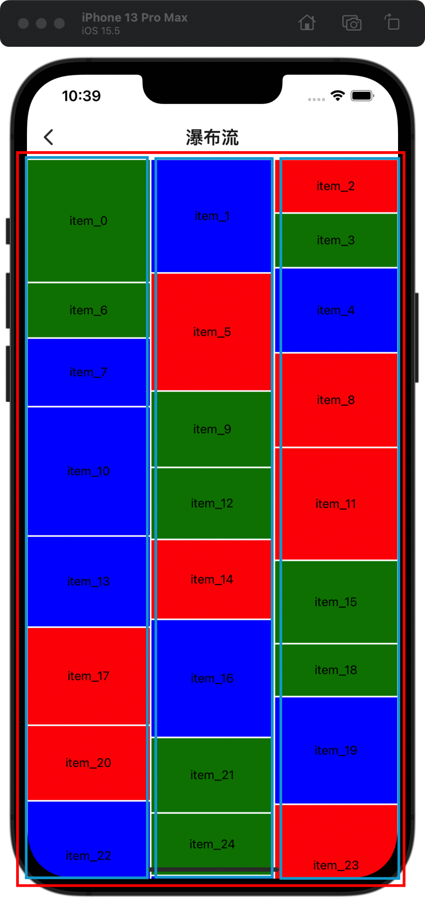

<center>react-native如何实现瀑布流</center>

## 前言
在之前的react-native项目中，有瀑布流列表的需求，查阅了很多资料、网上看了很多种实现，其中看到了一个思路：用ScrollView嵌套VirtualizedList实现，如图红色表示ScrollView,蓝色表示VirtualizedList，看上去是一个列表，实则是3个列表，
VirtualizedList的滚动事件全部委托给ScrollView进行处理
<center></center>


## 代码
```
import React, { Component, DetailedReactHTMLElement, LegacyRef } from 'react'
import {
  View,
  ScrollView,
  StyleSheet,
  RefreshControl,
  VirtualizedList,
  LayoutChangeEvent,
  NativeSyntheticEvent,
  NativeScrollEvent,
  StyleProp,
  ViewStyle
} from 'react-native'

export default class WaterfallList<T extends Record<string, any>> extends Component<
  WaterfallListProps<T>,
  WaterfallListState<T>
> {
  static defaultProps = {
    scrollEventThrottle: 50,
    numColumns: 1,
    renderScrollComponent: (props: WaterfallListProps) => {
      if (props.onRefresh && props.refreshing != null) {
        return (
          <ScrollView
            {...props}
            nestedScrollEnabled
            refreshControl={<RefreshControl refreshing={props.refreshing} onRefresh={props.onRefresh} />}
          />
        )
      }
      return <ScrollView {...props} />
    }
  }

  state = _reconstructData<T>(this.props)
  _listRefs: Array<VirtualizedList<T> | null> = []
  _scrollRef: ScrollView | null | undefined

  UNSAFE_componentWillReceiveProps(newProps: WaterfallListProps) {
    this.setState(_reconstructData<T>(newProps))
  }

  _onLayout = (event: LayoutChangeEvent) => {
    // @ts-ignore
    this._listRefs.forEach(list => list && list?._onLayout && list._onLayout(event))
  }

  _onContentSizeChange = (width: number, height: number) => {
    // @ts-ignore
    this._listRefs.forEach(list => list && list._onContentSizeChange && list._onContentSizeChange(width, height))
  }

  _onScroll = (event: NativeSyntheticEvent<NativeScrollEvent>) => {
    if (this.props.onScroll) {
      this.props.onScroll(event)
    }
    // @ts-ignore
    this._listRefs.forEach(list => list && list._onScroll && list._onScroll(event))
  }

  _onScrollBeginDrag = (event: NativeSyntheticEvent<NativeScrollEvent>) => {
    if (this.props.onScrollBeginDrag) {
      this.props.onScrollBeginDrag(event)
    }
    // @ts-ignore
    this._listRefs.forEach(list => list && list._onScrollBeginDrag && list._onScrollBeginDrag(event))
  }

  _onScrollEndDrag = (event: NativeSyntheticEvent<NativeScrollEvent>) => {
    if (this.props.onScrollEndDrag) {
      this.props.onScrollEndDrag(event)
    }
    // @ts-ignore
    this._listRefs.forEach(list => list && list._onScrollEndDrag && list._onScrollEndDrag(event))
  }

  _onMomentumScrollEnd = (event: NativeSyntheticEvent<NativeScrollEvent>) => {
    if (this.props.onMomentumScrollEnd) {
      this.props.onMomentumScrollEnd(event)
    }
    // @ts-ignore
    this._listRefs.forEach(list => list && list._onMomentumScrollEnd && list._onMomentumScrollEnd(event))
  }

  _getItemLayout = (columnIndex: number, rowIndex: number) => {
    const column = this.state.columns[columnIndex]
    let offset = 0
    for (let ii = 0; ii < rowIndex; ii += 1) {
      offset += column.heights[ii]
    }
    return { length: column.heights[rowIndex], offset, index: rowIndex }
  }

  _getItemCount = (data: Array<T>) => data.length

  _getItem = (data: Array<T>, index: number) => data[index]

  _captureScrollRef: LegacyRef<ScrollView> = ref => (this._scrollRef = ref)

  render() {
    const { renderItem, ListHeaderComponent, ListEmptyComponent, keyExtractor, onEndReached, ...props } = this.props
    let headerElement
    if (ListHeaderComponent) {
      headerElement = <ListHeaderComponent />
    }
    let emptyElement
    if (ListEmptyComponent) {
      emptyElement = <ListEmptyComponent />
    }

    const content = (
      <View style={styles.contentContainer}>
        {this.state.columns.map(col => (
          <VirtualizedList<T>
            {...props}
            ref={ref => (this._listRefs[col.index] = ref)}
            key={`$col_${col.index}`}
            data={col.data}
            getItemCount={this._getItemCount}
            getItem={this._getItem}
            getItemLayout={(data, index) => this._getItemLayout(col.index, index)}
            renderItem={({ item, index }) => renderItem({ item, index, column: col.index })}
            renderScrollComponent={() => <View style={styles.column} />}
            keyExtractor={keyExtractor}
            onEndReached={onEndReached}
            onEndReachedThreshold={this.props.onEndReachedThreshold}
            removeClippedSubviews={false}
          />
        ))}
      </View>
    )

    return React.cloneElement(
      this.props.renderScrollComponent(this.props),
      {
        ref: this._captureScrollRef,
        removeClippedSubviews: false,
        onContentSizeChange: this._onContentSizeChange,
        onLayout: this._onLayout,
        onScroll: this._onScroll,
        onScrollBeginDrag: this._onScrollBeginDrag,
        onScrollEndDrag: this._onScrollEndDrag,
        onMomentumScrollEnd: this._onMomentumScrollEnd
      },
      headerElement,
      emptyElement && this.props.data.length === 0 ? emptyElement : content
    )
  }
}

function _reconstructData<ItemT = any>(params: { numColumns: number; data: Array<any>; getHeightForItem: Function }) {
  const { numColumns, data, getHeightForItem } = params

  const columns: Array<Column<ItemT>> = Array.from({
    length: numColumns
  }).map((col, i) => ({
    index: i,
    totalHeight: 0,
    data: [],
    heights: []
  }))

  data.forEach((item, index) => {
    const height = getHeightForItem({ item, index })
    //判断数据项应该进的列
    const column = columns.reduce((prev, cur) => (cur.totalHeight < prev.totalHeight ? cur : prev), columns[0])
    column.data.push(item)
    column.heights.push(height)
    column.totalHeight += height
  })
  return { columns }
}

export type WaterfallListProps<ItemT = any> = {
  data: Array<ItemT>
  numColumns: number
  renderItem: ({ item, index, column }: { item: ItemT; index: number; column: number }) => React.ReactElement
  getHeightForItem: ({ item, index }: { item: ItemT; index: number }) => number
  ListHeaderComponent?: React.ComponentType<any>
  ListEmptyComponent?: React.ComponentType<any>
  keyExtractor?: (item: ItemT, index: number) => string
  onEndReached?: (info: { distanceFromEnd: number }) => void
  contentContainerStyle?: StyleProp<ViewStyle>
  onScroll?: (event: NativeSyntheticEvent<NativeScrollEvent>) => void
  onScrollBeginDrag?: (event: NativeSyntheticEvent<NativeScrollEvent>) => void
  onScrollEndDrag?: (event: NativeSyntheticEvent<NativeScrollEvent>) => void
  onMomentumScrollEnd?: (event: NativeSyntheticEvent<NativeScrollEvent>) => void
  onEndReachedThreshold?: number
  scrollEventThrottle: number
  renderScrollComponent: (props: Object) => DetailedReactHTMLElement<any, ScrollView>
  refreshing?: boolean
  onRefresh?: (() => void) | undefined
}

type Column<ItemT = any> = {
  index: number
  totalHeight: number
  data: Array<ItemT>
  heights: Array<number>
}

type WaterfallListState<ItemT = any> = {
  columns: Array<Column<ItemT>>
}

const styles = StyleSheet.create({
  contentContainer: {
    flex: 1,
    flexDirection: 'row'
  },
  column: {
    flex: 1
  }
})

```
使用
```
import React, { PureComponent } from 'react'
import { StyleSheet, View, Text } from 'react-native'
import { NavigationInjectedProps } from 'react-navigation'
import { Scene, WaterfallList } from '@comps'

type IData = {
  id: string
  height: number
  color: string
}

const COLORS = ['green', 'blue', 'red']
const DATA: Array<IData> = Array.from({ length: 200 }).map((_, i) => ({
  id: `item_${i}`,
  height: Math.round(Math.random() * 100 + 50),
  color: COLORS[i % COLORS.length]
}))

class Waterfall extends React.Component<NavigationInjectedProps, WaterfallState> {
  constructor(props: NavigationInjectedProps) {
    super(props)
    this.state = {
      isRefreshing: false
    }
  }

  _refreshRequest = () => {
    this.setState({ isRefreshing: true })
    setTimeout(() => {
      this.setState({ isRefreshing: false })
    }, 1000)
  }

  render() {
    const { navigation } = this.props
    return (
      <Scene title="瀑布流" navigation={navigation}>
        <WaterfallList<IData>
          onRefresh={this._refreshRequest}
          refreshing={this.state.isRefreshing}
          data={DATA}
          renderItem={({ item }) => <Cell item={item} />}
          getHeightForItem={({ item }) => item.height + 2}
          numColumns={3}
          keyExtractor={item => item.id}
        />
      </Scene>
    )
  }
}

export default Waterfall

type WaterfallState = {
  isRefreshing: boolean
}

class Cell extends PureComponent<{ item: { id: string; height: number; color: string } }> {
  render() {
    const { item } = this.props
    return (
      <View style={[styles.cell, { height: item.height, backgroundColor: item.color }]}>
        <Text>{item.id}</Text>
      </View>
    )
  }
}

const styles = StyleSheet.create({
  cell: {
    margin: 1,
    alignItems: 'center',
    justifyContent: 'center'
  }
})

```

## 问题
rn不推荐ScrollView嵌套VirtualizedList，版本0.64.0以前只是warning，在此之后变成了error
``` 
0.64.0以前
<ScrollView.Context.Consumer>
  {scrollContext => {
    if (
      scrollContext != null &&
      !scrollContext.horizontal === !this.props.horizontal &&
      !this._hasWarned.nesting &&
      this.context.virtualizedList == null
    ) {
      // TODO (T46547044): use React.warn once 16.9 is sync'd: https://github.com/facebook/react/pull/15170
      console.warn(
        'VirtualizedLists should never be nested inside plain ScrollViews with the same ' +
          'orientation - use another VirtualizedList-backed container instead.',
      );
      this._hasWarned.nesting = true;
    }
    return innerRet;
  }}
</ScrollView.Context.Consumer>
```

``` 
0.64.0以后
<ScrollView.Context.Consumer>
  {scrollContext => {
    if (
      scrollContext != null &&
      !scrollContext.horizontal ===
        !horizontalOrDefault(this.props.horizontal) &&
      !this._hasWarned.nesting &&
      this.context == null
    ) {
      // TODO (T46547044): use React.warn once 16.9 is sync'd: https://github.com/facebook/react/pull/15170
      console.error(
        'VirtualizedLists should never be nested inside plain ScrollViews with the same ' +
          'orientation because it can break windowing and other functionality - use another ' +
          'VirtualizedList-backed container instead.',
      );
      this._hasWarned.nesting = true;
    }
    return innerRet;
  }}
</ScrollView.Context.Consumer>
```


    

    

